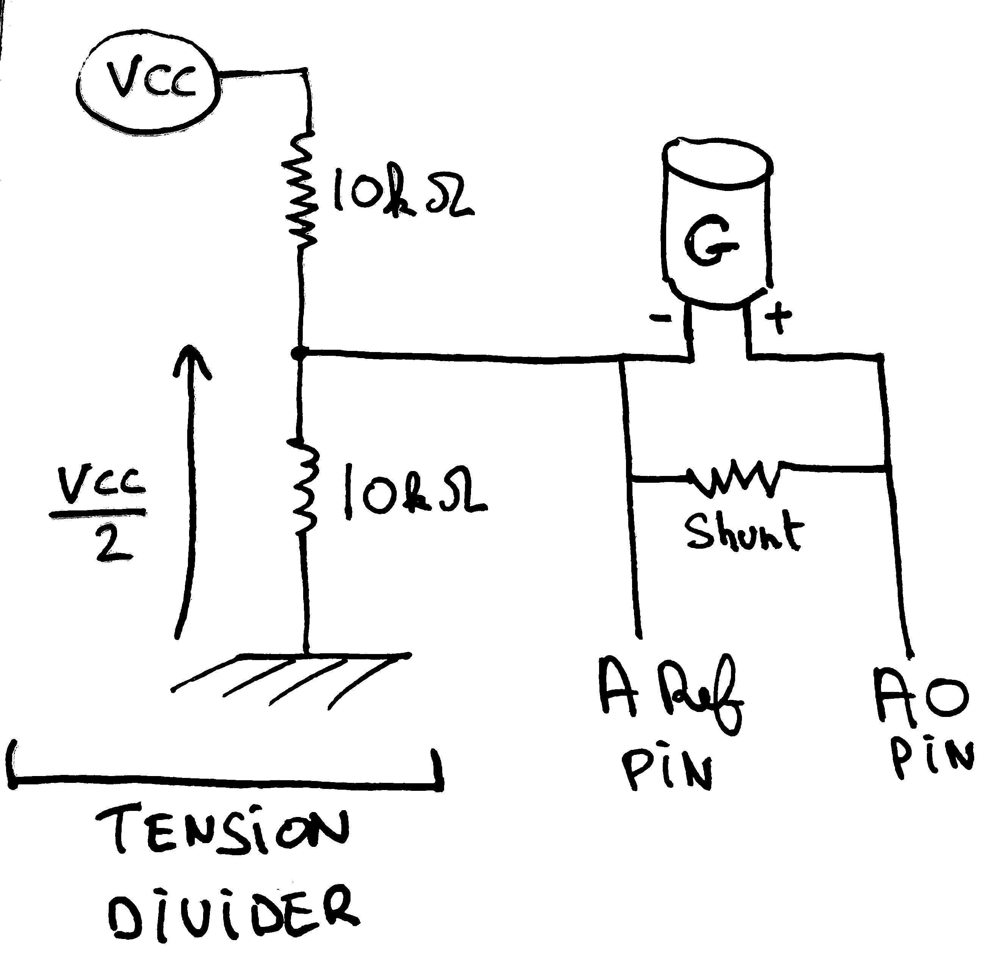
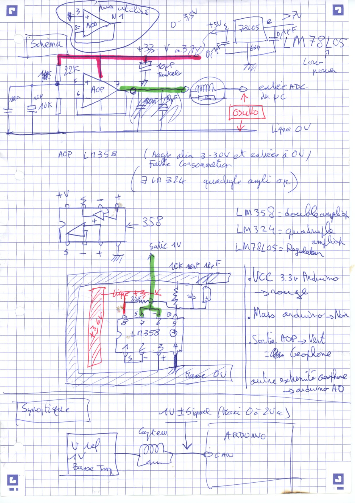
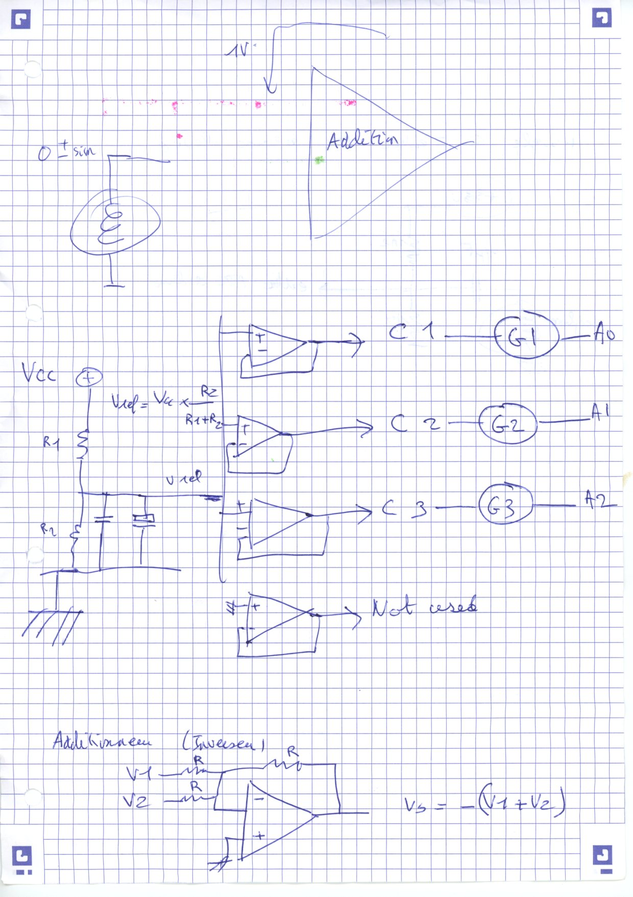
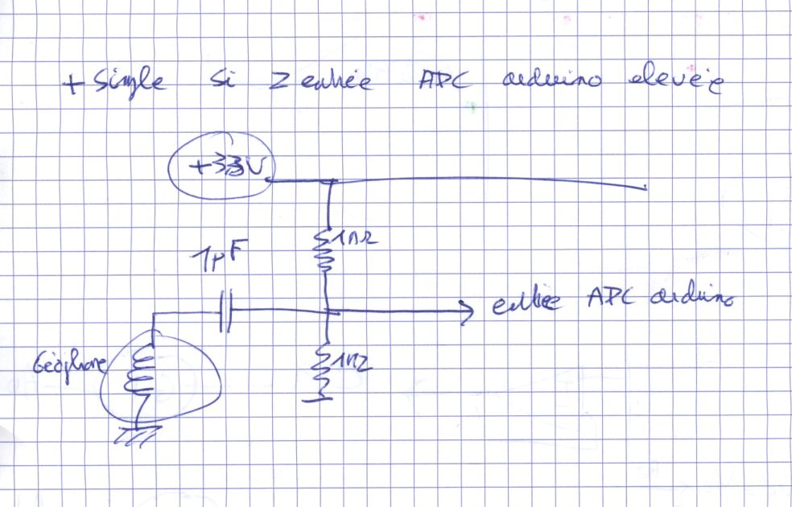

# Arduino Seismometer
Arduino based seismometer.
- Arduino ZeroMkr board (with SD Card slot for records saving), ZeroMKR board also has the highest (12 bits) Analog to Digital converter resolution of all current boards.
- GPS-MKR shield for precise timing of the events recorded and position of the module 
- External voltage divider to read both positive and negative voltage from the Geophone, as the Arduinos otherwise only reads positive voltage.
- Optional operational amplifier in following mode to insure the Arduino side shows a very high impedance to the geophone.

This project would deserve a complete write up and an "instructable" presentation. In the meantime, the main sketches and scripts are here.
For simplicity, average performance use the tension divider. For excellent performances, use the operational amplifier (follower mode) solution, just slightly more involved to build. 

Tension diviser sketch - very simple.

Operational amplifier sketch - slightly more advanced but better performances.

Operational amplifier sketch - 3 or 4 channels, for 3 geophone components + hydrophone component.

Capacitor sketch- an alternative, simple high impedence solution.

